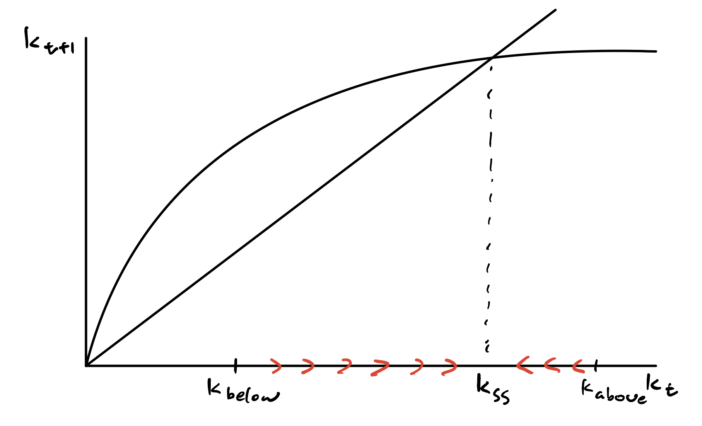

```{r setup, include=FALSE}
knitr::opts_chunk$set(echo = TRUE)
library(tidyverse)
```

# Q1

## a)

In the Solow Growth Model, firms face the problem $$\max_{K_{t},L_{t}} F(K_{t},L_{t})-w_{t} L_{t} - R_{t}K_{t}$$
where they are trying to choose the amount of capital ($K_{t}$) and labor ($L_{t}$) that maximizes their profit. Profit here is decomposed into revenue (price of 1 per good times amount of goods produced as determined by the production function $F(K_{t},L_{t})$) less cost (cost of labor is wage times amount of labor used $w_{t} L_{t}$ and cost of capital is rent times amount of capital used $R_{t}K_{t}$). 

## b)

Households supply labor inelastically and save a fraction of their income $s$ (determined exogenously) while consuming the rest. This means they make no decisions. 

## c)

Capital increases at a decreasing rate over time, eventually converging to a steady state level (assuming you start at a level of capital lower than the steady state). This is based on the law of motion of capital $K_{t+1} = I_t + (1-\delta)K_t$ where $I_t = sF(K_t, L_t)$. What this law is saying is that for each period $t$, the level of capital increases via saving a portion of the period's output while the level decreases due to a portion of the current amount of capital depreciating. 

The level of capital increases at a decreasing rate because as the level of capital increases, a larger amount of capital depreciates each period because total depreciation is a fixed proportion of the current level of capital. Additionally, as depreciation rises, the amount of new capital falls since the marginal product of capital falls as the level of capital increases (diminishing marginal returns). Eventually, the amount of new capital per period will equal the amount of capital depreciating per period, with this level of capital being called the steady state. 


$$Y_t = K_{t}^{\frac{1}{3}}L_{t}^{\frac{2}{3}}$$


## a)

$K_{t+1} = I_t + (1-\delta)K_t$ 

$I_t = sF(K_t,L_t) \Rightarrow K_{t+1} = sF(K_t,L_t) + (1-\delta)K_t$

## b)
$K_{t+1} = sF(K_t,L_t) + (1-\delta)K_t$, dividing both sides by $L_t$ results in 
$k_{t+1} = sy_t + (1-\delta)k_t$

## c)
Steady state is where $k_{t+1} = k_t$:

$k_{t+1} = sf(k_t) + (1-\delta)k_t = k_t$

$sf(k_t) + (1-\delta)k_t = k_t \Rightarrow sf(k_t)=\delta k_t$

$sf(k_t)=\delta k_t \Rightarrow \frac{s}{\delta} = \frac{k_t}{f(k_t)} \Rightarrow \frac{0.4}{0.05} = \frac{k_t}{k_t^{\frac{1}{3}}} \Rightarrow 8 = k_t^{\frac{2}{3}} \Rightarrow k_{ss} = 22.62742$

## d)



Countries that start with a level of capital above the steady state fall to the steady state level of capital since depreciation is higher than new capital via investment while those starting below see their capital increase to the steady state since the opposite is true. Both eventually converge.

## e)

Since the steady state is expressed as $k_{ss} = (\frac{s}{\delta})^{\frac{3}{2}}$, if the savings rate for LICs is lower than that of HICs, convergence still occurs but each group of countries converges to their own steady states. Assuming the depreciation rate and production function for these countries is the same and same as before, $k_{ss} = 2.828427$ for LICs and $k_{ss} = 22.62742$. Both sets of countries converge to steady state but LICs converge faster to a much lower steady state while it takes longer for HICs to converge but to a higher steady state (assuming both start at the same level of capital). In general, converge will take different amounts of time for countries in different groups. 

# Q2

## Page and Pande (2018)

### a)

Access to health care, access to education, property rights. 

### b)

While economic growth generally can alleviate poverty, they find that poverty can often times remain high even in countries with growth since growth generally does not mean everyone shares equally in it. As such, Page and Pande argue that redistribution is necessary to increase the speed of poverty reduction. However, they state that traditional methods of redistribution such as cash transfers or physical infrastructure are not enough, illustrating how these methods either fail to help everyone out of poverty or are not sustainable. This leads into their argument that "invisible infrastructure" such as healthcare, education, payment systems, robust institutions, etc. are necessary to ensure that people can be sustainably lifted out of poverty and break intra and inter generational poverty. 


## Mankiw, Romer, and Weil (1992) - MRW

### c)

A potential danger of sample selection in this context is that data is typically more available from richer countries since they are more likely to collect information about the measures used in the paper. Subsequently, the paper may overestimate the usefulness of human capital in explaining growth since rich countries that are more likely to appear in the dataset also are more likely to be investing in human capital, confounding the actual estimate of human capital's impact on growth in the augmented Solow Model. 

### d)

Formally, we would need to assume that treatment conditioning on our observed covariates is independent of unobserved factors such as institutions or culture (Selection on Observables). In this context, the "treatment" and outcome relate to how the data and specifically coefficients fit the Solow model since we are trying to see how much growth can be explained via the variables in the model. This assumption is not plausible, even when including human capital since there are still most likely unobserved determinants that affect both the "treatment" and outcome. 

### e)

No, they add up to more than 121. This does not affect our interpretation because MRW are running regressions on specific subsets of the data (with the latter two being subsets of the first), meaning that we would just interpret each regression based on the specific country subset/sample as described earlier in the paper.

## Kremer, Willis, and You (2021) - KWY

### f)

KWY find that while in the past it appeared that countries in different groups were diverging, these groups were actually conditionally converging to their own steady states. Furthermore, as the correlates of growth in these groups converged to those of higher income nations, they began to see absolute convergence among all countries. Hence, these groups conditionally converged to absolute convergence. 

# Q3

## Setup

### 1 and 2)

```{r}
dev_ind <- read.csv('./pset1_data/development_indicators.csv')
clf <- read.csv('./pset1_data/classifications.csv')
```
```{r}
df <- left_join(dev_ind,clf,by='countrycode')
```

### 3)

```{r}
df <- df %>% 
  mutate(LMIC_ind = if_else(str_detect(tolower(income_level),'low') |
                              str_detect(tolower(income_level),'lower') |
                              str_detect(tolower(income_level),'middle'),1,0))
```

## Tables and Figures

### 4)

```{r message=F}
df %>% 
  filter((year == 2015) & (!is.na(gdp_growth))) %>%
  group_by(income_level) %>%
  summarise(mean_GDPgrowth = mean(gdp_growth),
            sd_GDPgrowth = sd(gdp_growth))
```

Mean GDP growth does not provide clear separation of groups of countries, since high income countries have higher average growth than low income nations, but lower middle has higher average growth than upper middle. This lack of separation in growth levels between country groups is further supported by the high standard deviation in GDP growth in 2015, with standard deviation being similar to or larger than the mean values. 

### 5)

```{r}
df_5 <- df %>%
  pivot_wider(id_cols = c(countryname.x,LMIC_ind),
              names_from = year,
              names_prefix = 'gdp_growth',
              values_from = gdp_growth) %>%
  na.omit()
df_5_LMIC <- df_5 %>%
  filter(LMIC_ind==1)
```
```{r fig.dim=c(5,5), out.width='60%', fig.align='center'}
ggplot(data=df_5,mapping=aes(x=gdp_growth1990,y=gdp_growth2015)) + 
  geom_point(size = 1, position = position_jitter()) +
  geom_abline(slope=1,intercept=0, alpha = 0.6, linetype='dashed') + 
  geom_hline(yintercept = 0, alpha=0.7) +
  geom_vline(xintercept = 0, alpha=0.7) + 
  theme_light() + ggtitle("Comparing 1990 and 2015 GDP Growth (Full Sample)") +
  xlab("GDP Growth 1990 (%)") + ylab("GDP Growth 2015 (%)") +
  coord_fixed(xlim=c(-15,15), ylim=c(-15,15)) +
  theme(plot.title = element_text(family = 'serif', hjust = 0.5, size = 12), 
        axis.title.x = element_text(family = 'serif', size = 10),
        axis.title.y = element_text(family = 'serif', size = 10))
```

```{r fig.dim=c(5,5), out.width='60%', fig.align='center'}
ggplot(data=df_5_LMIC,mapping=aes(x=gdp_growth1990,y=gdp_growth2015)) + 
  geom_point(size = 1, position = position_jitter()) +
  geom_abline(slope=1,intercept=0, alpha = 0.6, linetype='dashed') + 
  geom_hline(yintercept = 0, alpha=0.7) +
  geom_vline(xintercept = 0, alpha=0.7) + 
  theme_light() + ggtitle("Comparing 1990 and 2015 GDP Growth (LMIC)") +
  xlab("GDP Growth 1990 (%)") + ylab("GDP Growth 2015 (%)") +
  coord_fixed(xlim=c(-15,15), ylim=c(-15,15)) +
  theme(plot.title = element_text(family = 'serif', hjust = 0.5, size = 12), 
        axis.title.x = element_text(family = 'serif', size = 10),
        axis.title.y = element_text(family = 'serif', size = 10))
```

If a country is above the 45 degree line, it means that their GDP growth has increased compared to 1990, If they are below the line, then their GDP growth has decreased since 1990.

### 6)

```{r message=F}
df_6a <- df %>% 
  filter(!is.na(enroll_primary_t)) %>%
  group_by(year,income_level) %>%
  summarise(primary = mean(enroll_primary_t),.groups='keep')
```

```{r fig.dim=c(5,4), out.width='75%', fig.align='center'}
ggplot(data=df_6a,mapping=aes(x=year,y=primary,color=income_level)) +
  geom_line() +
  theme_light() + ggtitle("Different Trends in Primary School Enrollment") +
  xlab("Year") + ylab("Total Primary School Enrollment (%)") +
  theme(plot.title = element_text(family = 'serif', hjust = 0.5, size = 12), 
        axis.title = element_text(family = 'serif', size = 10),
        axis.text = element_text(family = 'serif',size=8),
        legend.title =element_text(family = 'serif', size = 10),
        legend.text =element_text(family = 'serif', size = 10)) +
  scale_color_manual(values=c("#070071", "#6EE1FF", "#38A0FA",'#385DFA'),
                     name='Income Group',
                     limits = c("High Income","Upper Middle Income",
                                "Lower Middle Income","Low Income"))
```

#### a)

While high and upper middle income stayed roughly the same, low and lower middle income increased then fell after 2010, potentially due to the financial crisis in 2008. In general, it appears that total primary school enrollment is correlated with income level since the enrollment percentage order is the same as income group order

#### b)

We cannot say for sure that total primary school enrollment is correlated with income level since we only know the income level as of 2019. Prior data points such as 1990 could have had countries in different income levels. As such, we can only say that countries that are wealthier now have higher levels of primary school enrollment than countries that are poorer now.

### 7)

```{r}
df_7 <- df %>%
  select(year,countrycode,gdp_percap,enroll_primary_t) %>%
  group_by(countrycode) %>%
  mutate(diff = enroll_primary_t - lag(enroll_primary_t)) %>% 
  filter(!is.na(diff)) %>%
  group_by(year) %>%
  mutate(quant = factor(cut(gdp_percap,quantile(gdp_percap, probs = seq(0, 1, 1/4),na.rm=T),include.lowest=TRUE,labels=FALSE))) %>%
  filter(!is.na(quant)) %>%
  group_by(year,quant) %>%
  summarise(primary=mean(diff),.groups='keep') 
```
```{r fig.dim=c(5,4), out.width='75%', fig.align='center'}
ggplot(data=df_7,mapping=aes(x=year,y=primary,color=quant)) +
  geom_line() +
  theme_light() + ggtitle("Different Trends in Primary School Enrollment") +
  xlab("Year") + ylab("Total Primary School Enrollment (%)") +
  theme(plot.title = element_text(family = 'serif', hjust = 0.5, size = 12), 
        axis.title = element_text(family = 'serif', size = 10),
        axis.text = element_text(family = 'serif',size=8),
        legend.title =element_text(family = 'serif', size = 10),
        legend.text =element_text(family = 'serif', size = 10))
```

No, we see similar trends with the lowest income nations seeing the largest gains while the higher income countries stay relatively similar.

### 8)

```{r}
df_8 <- df %>%
  pivot_longer(cols = c(enroll_second_m,enroll_secondary_f),
               names_to = 'gender',
               values_to='enroll_sec') %>%
  select(income_level,gender,enroll_sec,LMIC_ind,gdp_growth,gdp_percap)
```
```{r fig.dim=c(6,4), out.width='75%', fig.align='center'}
df_8_bar <- df_8 %>%
  filter(!is.na(enroll_sec))
ggplot(data = df_8_bar, 
       mapping = aes(x=factor(
         income_level,c("High Income","Upper Middle Income",
                        "Lower Middle Income","Low Income")), 
                     y=enroll_sec, fill=gender)) +
  geom_col(position = 'dodge',width = 0.5) + 
  theme_light() + ggtitle("Gender Gap in Secondary Enrollment") +
  xlab("Income Level") + ylab("Secondary School Enrollment") +
  theme(plot.title = element_text(family = 'serif', hjust = 0.5, size = 12), 
        axis.title = element_text(family = 'serif', size = 10),
        axis.text = element_text(family = 'serif',size=8),
        legend.title =element_text(family = 'serif', size = 10),
        legend.text =element_text(family = 'serif', size = 10)) +
  scale_fill_manual(values=c("#070071", "#38A0FA"),
                     name='Gender',
                     labels = c("Male","Female"))
```

We see that at all income levels except low, we see that female secondary school enrollment is greater than male. This could be indicative of potential social or cultural barriers to education facing those specifically in low income nations, as mentioned in Page and Pande (2018). 